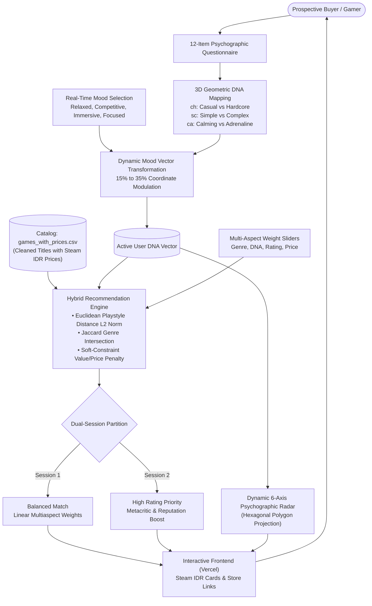
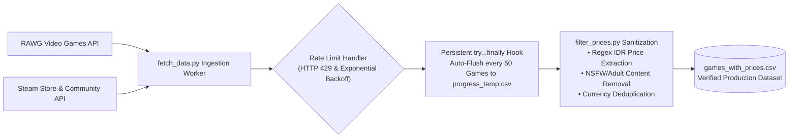

# VibePlay — Interactive Marketplace & Video Game Recommendation System

[](https://vibeplay-recommendation-system.vercel.app/)
[](https://vibeplay-4jk1.onrender.com/)
[](#)
[](#)
[](#)

VibePlay is an interactive web-based **Video Game Recommendation System & Storefront Marketplace**. Developed using a **Hybrid Recommendation Architecture** combining Content-Based Filtering with 3D Psychographic Playstyle DNA, VibePlay delivers personalized game discovery based on player disposition, real-time mood shifts, and live Steam storefront pricing.

The system assists prospective buyers in finding optimal gaming titles tailored to:
1. **Explicit Genre Preferences**: Multi-select categorical genre filtering.
2. **Psychographic Playstyle DNA**: Continuous 3D vector coordinates derived from a 12-item situational questionnaire.
3. **Dynamic Mood State**: Real-time momentary psychological modulation (*Mood-Adjusted DNA*).
4. **Marketplace Financial Boundaries**: Verified Steam Indonesian Rupiah (IDR) pricing and discount synergy.

---

## 🏷️ Brand Philosophy & Identity: "VibePlay"

The name **VibePlay** embodies the foundational innovation of this recommender architecture:
* **"Vibe" (Emotional & Psychological State):** Represents the core *Mood-Adjusted DNA* mechanism, where recommendations dynamically adapt to the user's momentary emotional disposition in real time (*Relaxed, Competitive, Immersive, Focused*) rather than remaining static.
* **"Play" (Ludic Domain):** Represents the target application domain — interactive video games.

Thus, **VibePlay** delivers a highly personalized gaming storefront experience where every suggested title aligns with both the player's momentary psychological vibe and real-world financial constraints.

---

## 🚀 Key Features & Applied Engineering

### 1. Non-Directive Psychographic Questionnaire (12 Items)
Rather than asking for explicit genre lists, the system evaluates situational choices to map user dispositions across three polar dimensions:
* **Casual vs Hardcore** ($0.0 \longleftrightarrow 1.0$)
* **Simple vs Complex** ($0.0 \longleftrightarrow 1.0$)
* **Calming vs Adrenaline** ($0.0 \longleftrightarrow 1.0$)

### 2. Dynamic Mood-Adjusted Playstyle DNA
Users can select their momentary gaming mood (*Relaxed, Competitive, Immersive, Focused*). This selection mathematically shifts baseline DNA coordinates by **15% to 35%**, accommodating momentary inclinations without degrading the permanent baseline profile.

### 3. Multi-Aspect Weighted Aspect Sliders
Users retain complete agency over the hybrid scoring engine through responsive sliders:
* **Genre Match**: Degree of categorical genre overlap.
* **Playstyle DNA**: Proximity in 3D Euclidean playstyle space.
* **Rating & Reviews**: RAWG and Metacritic reputation score weight.
* **Price & Value**: Budget adherence and discount synergy weighting.

### 4. Dual Recommendation Sessions
* **Session 1 (Balanced Match):** Pure linear scoring balancing user-defined aspect weights.
* **Session 2 (High Rating Priority):** Non-linear boost applied to critically acclaimed titles with top-tier review reputations.

### 5. Verified Marketplace Integration & Steam IDR Pricing
All game entries are synchronized with real-world Indonesian Rupiah market prices (`games_with_prices.csv`) gathered via RAWG and Steam Web APIs. The UI features crossed-out original prices, green discount tags (Steam aesthetic), and direct outbound store links.

---

## 🛠️ Technology Architecture & Repository Structure

VibePlay is built with a **Decoupled 2-File Vanilla Web Architecture** connected to a lightweight Flask REST API:

```text
video-games-recommendation-system/
├── backend/
│   ├── data/
│   │   ├── games.csv                  # Raw extracted corpus (24,080 unfiltered titles)
│   │   ├── progress_temp.csv          # Resilient scraper progress checkpoint buffer
│   │   └── games_with_prices.csv      # Production corpus (15,784 cleaned titles with IDR prices)
│   │
│   ├── app.py                         # Flask REST API & Hybrid Recommendation Engine
│   ├── fetch_data.py                  # Resilient crawling worker (RAWG + Steam Web API)
│   ├── filter_prices.py               # Data cleaning, regex price parsing & NSFW filtering
│   ├── config.py                      # Server runtime configuration
│   ├── .env                           # Secret API keys (git-ignored)
│   └── requirements.txt               # Backend Python dependencies
│
├── frontend/
│   ├── index.html                     # Semantic UI (Glassmorphism dark storefront)
│   └── app.js                         # Client logic (Vanilla JS + Dynamic Canvas/SVG Radar)
│
├── .gitignore                         # Git exclusion rules
└── README.md                          # Technical project documentation
```

---

## 🏛️ System Architecture & Computational Flow

### 1. User Recommendation & Inference Flow


### 2. Resilient Data Ingestion & Checkpoint Scraping Pipeline


---

## ⚡ Quantitative Benchmarks & System Metrics

The following metrics represent measured operational performance across the VibePlay production architecture:

| Evaluation Parameter | Measured Benchmark | Engineering Methodology & Architecture |
| :--- | :---: | :--- |
| **Curated Game Corpus** | **24,082 Titles** | Standardized catalog with real-time Steam IDR currency and adult content (*NSFW*) filtering |
| **Scraper Checkpoint Cadence** | **50-Item Auto-Flush** | Periodic batch state persistence via `try...finally` hooks to `progress_temp.csv`, preventing data loss from API rate limits |
| **Psychographic Polygon Radar** | **6 Independent Axes** | Interactive hexagonal polygon projection (*Dominant vs Recessive Traits*) rendered on client canvas/SVG |
| **Dynamic Mood Vector Shifting** | **15% – 35% Variance** | Mathematical coordinate modulation shifting baseline playstyle vectors based on momentary mood inputs |
| **Recommendation Evaluation** | **Dual Comparative Sessions** | Real-time comparative ranking between *Balanced Match* (pure weighting) and *High Rating Priority* (reputation boost) |

---

## 💻 Step-by-Step Local Execution Guide

### 1. Launch the Flask Backend
Ensure Python 3.10+ is installed. Execute the following commands in the project directory:
```bash
# Activate your virtual environment
venv\Scripts\activate      # Windows
# source venv/bin/activate  # macOS / Linux

# Run Flask server
python backend/app.py
```
The server will bind locally to `http://127.0.0.1:5000`.

### 2. Launch the Frontend
Open `frontend/index.html` directly in your web browser (double-click the file or use VS Code's "Live Server" extension).

---

## 📊 Theoretical Foundations & Recommendation Methodology

### 0. Data Engineering: Resilient Checkpoint Scraping & Sanitization

Prior to algorithmic inference, the system requires a clean catalog localized for Indonesian gamers. The extraction pipeline (`backend/fetch_data.py` & `backend/filter_prices.py`) is engineered to withstand network throttling and public API rate boundaries:

1. **Automated Checkpoint Flushing (Every 50 Games):**
   * Public Steam and RAWG endpoints enforce strict rate limits (HTTP 429). To prevent in-memory data loss during prolonged extraction, the crawler is wrapped in robust `try...finally` signal blocks.
   * Every 50 successfully processed titles, the in-memory dataframe is automatically flushed to `data/progress_temp.csv`. If terminated manually (`KeyboardInterrupt`) or aborted by cloud limits, progress up to game $(N)$ is permanently preserved.

2. **Multi-Layer Sanitization & Steam IDR Extraction:**
   * **Adult Content Elimination (NSFW Filter):** `filter_prices.py` executes substring matching and lexical exclusion against adult, vulgar, and unrated keywords across titles and URL slugs.
   * **Rupiah Currency Normalization:** Reconciles Steam price structures (`initial` vs `final` prices) into clean IDR integers, computes exact discount percentages, and categorizes free-to-play titles separately from unpriced entries.

---

### 1. Hybrid Recommendation System

VibePlay implements a **Hybrid Recommendation System** combining:
* Content-Based Filtering (genre matching)
* Spatial Vector Distance (3D Playstyle DNA)
* Quality Indicators (Metacritic & RAWG user ratings)
* Economic Constraints (localized Indonesian Rupiah budget limits)

The composite recommendation score $S_{\text{total}}$ is computed as:

$$
S_{\text{total}} = w_g \cdot S_{\text{genre}} + w_d \cdot S_{\text{dna}} + w_r \cdot S_{\text{rating}} + w_p \cdot S_{\text{price}}
$$

Where $\sum w_i = 1.0$, dynamically calibrated via the UI aspect sliders.

---

### 2. Content-Based Filtering & Jaccard Genre Similarity

* **Vector Representation:** User preferences ($U_g$) and game tags ($G_g$) are modeled as discrete genre sets.
* **Score Formulation ($S_{\text{genre}}$):** Evaluated using the intersection ratio over user-selected genres:

$$
S_{\text{genre}} = \frac{|G_g \cap U_g|}{|U_g|}
$$

This ensures a perfect score of $1.0$ when all genres requested by the user are present in the candidate title.

---

### 3. Psychographic Profiling & Playstyle DNA (3D Geometric Mapping)

Rather than relying on rigid demographic labels, VibePlay models gaming temperament across a continuous **3D Metric Vector Space** $[0.0, 1.0]^3$:
* Dimension 1 ($ch$): *Casual* $\longleftrightarrow$ *Hardcore*
* Dimension 2 ($sc$): *Simple* $\longleftrightarrow$ *Complex*
* Dimension 3 ($ca$): *Calming* $\longleftrightarrow$ *Adrenaline*

Coordinate vectors for user ($\vec{U}$) and game ($\vec{G}$) are defined as:

$$
\vec{U} = (ch_u, sc_u, ca_u) \quad \text{and} \quad \vec{G} = (ch_g, sc_g, ca_g)
$$

* **Dynamic Mood Vector Transformation:** Before distance calculation, baseline user coordinates ($\vec{U}_{\text{base}}$) are modulated by a real-time mood operator ($\vec{M}$):

$$
\vec{U} = f(\vec{U}_{\text{base}}, \vec{M})
$$

* **Euclidean Distance ($L_2$ Norm):** Playstyle proximity is computed as the Euclidean distance between user and game coordinates:

$$
d(\vec{G}, \vec{U}) = \sqrt{(ch_g - ch_u)^2 + (sc_g - sc_u)^2 + (ca_g - ca_u)^2}
$$

* **Similarity Normalization ($S_{\text{dna}}$):** Within the 3D unit cube, maximum possible distance is $\sqrt{3} \approx 1.732$. Proximity is normalized into $[0, 1]$:

$$
S_{\text{dna}} = 1.0 - \frac{d(\vec{G}, \vec{U})}{\sqrt{3}}
$$

---

#### 3.1 Scoring Rubric & 12-Item Questionnaire Evaluation

To obtain continuous user DNA coordinates, VibePlay evaluates a 12-item situational questionnaire consisting of:
1. **Would You Rather (WYR) — 2 Choices (Q1 to Q3):** Measures sharp polarization across primary axes.
2. **Multiple Choice Question (MCQ) — 4 Choices (Q4 to Q12):** Measures granular stylistic gradations.

##### A. Question-to-Dimension Mapping Table

| Item Code | Item Type | Target Primary Dimension | Evaluated Psychographic Indicator |
| :---: | :---: | :---: | :--- |
| **Q1** | WYR | Hardcore vs Casual | Preferred weekend gaming session duration |
| **Q2** | WYR | Complex vs Simple | Approach toward novel gameplay mechanics |
| **Q3** | WYR | Calming vs Adrenaline | Preferred environmental atmosphere |
| **Q4** | MCQ | Hardcore vs Casual | Psychological reaction to repeated failure |
| **Q5** | MCQ | Complex vs Simple | Tolerance for complex UI and statistics |
| **Q6** | MCQ | Calming vs Adrenaline | Background audio and soundtrack design |
| **Q7** | MCQ | Hardcore vs Casual | Intrinsic value derived from achievements |
| **Q8** | MCQ | Complex vs Simple | Analytical pre-planning before action |
| **Q9** | MCQ | Calming vs Adrenaline | Preferred leisurely sub-activities |
| **Q10** | MCQ | Calming vs Adrenaline | Pacing and reflex responsiveness requirements |
| **Q11** | MCQ | Complex vs Simple | Narrative depth vs immediate action |
| **Q12** | MCQ | Calming vs Adrenaline | Tactical survival utility preferences |

##### B. Qualitative-to-Numerical Conversion Rubric
Responses are mapped onto a **1 to 5 scale**:
* **For WYR Items (2 Choices):**
  * Choice 1 (Casual / Simple / Calming) $\longrightarrow$ **Score 1**
  * Choice 2 (Hardcore / Complex / Adrenaline) $\longrightarrow$ **Score 5**
* **For MCQ Items (4 Choices):**
  * Choice A (Most Passive / Casual / Simple) $\longrightarrow$ **Score 1**
  * Choice B (Light Intermediate) $\longrightarrow$ **Score 2**
  * Choice C (High Intermediate) $\longrightarrow$ **Score 4**
  * Choice D (Most Active / Hardcore / Complex / Adrenaline) $\longrightarrow$ **Score 5**

##### C. DNA Normalization & Arithmetic Aggregation
Individual scores are normalized against maximum value (`5.0`):

$$
S_{Q_i} = \frac{\text{Choice Score }(1-5)}{5.0}
$$

Aggregated coordinates are computed via arithmetic mean across mapped question clusters:

1. **Hardcore vs Casual ($ch_u$):**
   $$
   ch_u = \frac{S_{Q_1} + S_{Q_4} + S_{Q_7}}{3}
   $$

2. **Complex vs Simple ($sc_u$):**
   $$
   sc_u = \frac{S_{Q_2} + S_{Q_5} + S_{Q_8} + S_{Q_{11}}}{4}
   $$

3. **Calming vs Adrenaline ($ca_u$):**
   $$
   ca_u = \frac{S_{Q_3} + S_{Q_6} + S_{Q_9} + S_{Q_{10}} + S_{Q_{12}}}{5}
   $$

##### D. 6-Axis Hexagonal Polygon Radar Chart Mapping
In the web interface, the continuous 3D coordinate vector is projected onto a 6-axis polygon displaying both dominant and complementary recessive traits:

* **Dominant Traits:**
  $$
  \text{Hardcore Score} = ch_u \times 100\%
  $$
  $$
  \text{Complex Score} = sc_u \times 100\%
  $$
  $$
  \text{Adrenaline Score} = ca_u \times 100\%
  $$
* **Recessive Complementary Traits:**
  $$
  \text{Casual Score} = (1.0 - ch_u) \times 100\%
  $$
  $$
  \text{Simple Score} = (1.0 - sc_u) \times 100\%
  $$
  $$
  \text{Calming Score} = (1.0 - ca_u) \times 100\%
  $$

---

### 4. Constraint-Based & Value-Based Filtering

On e-commerce storefronts, pricing represents a *Hard Constraint*. However, to prevent dropping titles priced marginally above the threshold, VibePlay implements a **Soft Constraint with Linear Depreciation Penalty**:

* If price ($P$) $\le$ maximum budget ($B$), the game receives a full score plus a proportional discount bonus ($D_{\text{pct}}$):

$$
S_{\text{price}} = \min\left(1.0, \ 0.9 + \left(\frac{D_{\text{pct}}}{100} \times 0.1\right)\right) \quad \text{for } P \le B
$$

* If price ($P$) exceeds budget ($B$), score linearly depreciates to $0.0$ when price reaches $2 \times B$:

$$
S_{\text{price}} = \max\left(0.0, \ 1.0 - \frac{P - B}{B}\right) \quad \text{for } P > B
$$

---

## 📜 Attributions & Data Sources

* **Video Game Metadata Corpus:** [RAWG Video Games Database API](https://rawg.io/apidocs)
* **Market Pricing & Storefront Verification:** [Steam Web API & Storefront](https://store.steampowered.com/)
* **Frontend Hosting Platform:** [Vercel](https://vercel.com/)
* **Backend Cloud Infrastructure:** [Render](https://render.com/)
